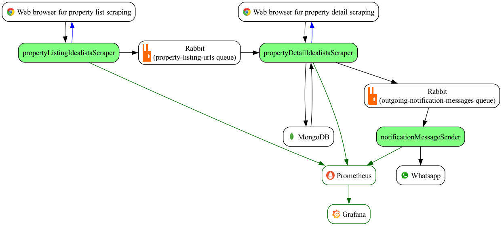

# Idealista Scraper

## Product highlights

Intended audience:
- People searching for homes to buy or rent in Spain
- Realtors and real estate professionals who need structured data from public listings

Problem this product solves:
- The market is highly competitive. Finding attractive properties early is difficult, and competition from other buyers or renters is intense. This product helps users react faster by detecting new listings near real time, instead of relying only on Idealista's standard email alerts.

Product definition:
- A system that scrapes public real estate listings in Spain (initially Idealista), builds a database (including image data) for a filtered subset of the market, and sends real-time WhatsApp notifications for relevant opportunities.
- Given that public information is downloaded, this data can be used to analyze information about past market situation. After a property has been removed from original source, can be still queried from the local copy.
- Since images are downloaded, additional tools to leverage Artificial Inteligence (for example to analyze images) can be developed. Note this product is also a research testbed on architecture and interior design.

# Software architecture

This system comprises several micro services that interacts with each other as shown in the following diagrams:



- Blue arrows means that a micro service controls a web browser using the CDP protocol.
- Black arrows shows information flow.
- Green background components are the micro services that makes up this project.

The architecture componentes are:

- [Page list scraper](propertyListingScraper/README.md): scraper that controls a Google Chrome web browser to get the list of properties given a set of filters. The resulting URLs for properties are written to RabbitMq.
- [Page detail scraper](propertyDetailScraper/README.md): consumes property URLs from RabbitMq and downloads property details from Idealista source using a second and separate instance of Google Chrome. Given the property information, the information is stored in the mongodb database, and notifications are sent via whatsapp.
- [Notification message sender](notificationMessageSender/README.md): consumes messages from RabbitMq that are intended to be sent to a Whatsapp user or group.
- Whatsapp notification sender: Service to send notification to whatsapp. Works reading messages written to RabbitMq.

# RabbitMq management

## RabbitMq installation

On MacOS, this set of projects requires to install and configure a RabbitMq server. It can be
done by:

```bash
brew update
brew install rabbitmq
rabbitmq-plugins enable rabbitmq_management
brew services start rabbitmq
```

And browse to http://localhost:15672/ . Default user `guest` and default password `guest` are encouraged to be changed! In the web UI this can be done on the `Admin` tab. Also with the following commands:

```bash
rabbitmqctl add_user <ADMIN_USER> '<PASSWORD>'
rabbitmqctl set_permissions -p / <ADMIN_USER> ".*" ".*" ".*"
rabbitmqctl set_user_tags <ADMIN_USER> administrator
rabbitmqctl list_users
rabbitmqctl set_permissions -p dev <ADMIN_USER> ".*" ".*" ".*"      
rabbitmqctl list_permissions -p /
rabbitmqctl delete_user guest
```

## RabbitMq initial configuration

```bash
rabbitmqctl add_vhost dev
rabbitmqctl add_user propertylist_user '<some password1>'
rabbitmqctl add_user propertydetail_user '<some password2>'

rabbitmqctl set_permissions -p dev propertylist_user ".*" ".*" ".*"
rabbitmqctl set_permissions -p dev propertydetail_user ".*" ".*" ".*"

rabbitmqadmin -V dev declare exchange name=events.x type=topic durable=true
rabbitmqadmin -H localhost -P 15672 -u <ADMIN_USER> -p '<PASSWORD>' -V dev declare exchange name=events.x type=topic durable=true
rabbitmqadmin -H localhost -P 15672 -u <ADMIN_USER> -p '<PASSWORD>' -V dev declare queue name=serviceB.q durable=true
rabbitmqctl set_user_tags propertylist_user management
rabbitmqctl set_user_tags propertydetail_user management

# Binding
rabbitmqadmin -H localhost -P 15672 -u <ADMIN_USER> -p '<PASSWORD>' -V dev \
  declare binding source=events.x destination_type=queue destination=serviceB.q routing_key="property.list.updated"
rabbitmqadmin -H localhost -P 15672 -u <ADMIN_USER> -p '<PASSWORD>' -V dev \
  declare binding source=events.x destination_type=queue destination=serviceB.q routing_key="property.#"
```

## RabbitMq manual test on CLI for validating micro service user credentials

Now it can be tested manually if messages can be produced and consumed:

```bash
# Verify that users for micro services have proper permissions .* .* .*
rabbitmqctl list_permissions -p dev | egrep 'propertylist_user|propertydetail_user'

# Write a message
rabbitmqadmin -H localhost -P 15672 -u propertylist_user -p '<some password1>' -V dev \
  publish exchange=events.x routing_key="property.list.updated" payload='{"hello":"world"}' properties='{"content_type":"application/json"}'

# Consume a message
rabbitmqadmin -H localhost -P 15672 -u propertydetail_user -p '<some password2>' -V dev \
  get queue=serviceB.q requeue=false

# Should show something like this the first time, and "No items" when retried:
# +-----------------------+----------+---------------+-------------------+---------------# +------------------+-------------+
# |      routing_key      | exchange | message_count |      payload      | payload_bytes | payload_encoding | redelivered |
# +-----------------------+----------+---------------+-------------------+---------------+------------------+-------------+
# | property.list.updated | events.x | 0             | {"hello":"world"} | 17            | string           | False       |
# +-----------------------+----------+---------------+-------------------+---------------+------------------+-------------+
```

After this manual test works, put the credentials in the `secrets.json` file for each micro service.

# MongoDB management

The `propertyDetailScraper` micro service uses a MongoDB to store the scraped property  information. To install this database locally on MacOS do:

```bash
brew tap mongodb/brew
brew install mongodb-community mongosh
sudo brew services start mongodb-community
```

Edit MongoDB configuration to accept external/local connections as needed, update bind IP in:

```bash
/opt/homebrew/etc/mongod.conf
```

Use:

```yaml
net:
  port: 27017
  bindIp: 0.0.0.0
```

Then restart MongoDB and verify is working:

```bash
brew services restart mongodb-community
```

Verify MongoDB is running:

```bash
brew services list | grep mongodb-community
mongosh --eval "db.runCommand({ ping: 1 })"
```

Create the database `idealistaScraper` and an application user:

```bash
mongosh
```

Then execute in the shell:

```javascript
use idealistaScraper
db.createUser({user: "propertydetail_user", pwd: "<some password>", roles: [{ role: "readWrite", db: "idealistaScraper" }]})
db.getUsers()
```

Connect from terminal with authentication:

```bash
mongosh --host localhost --port 27017 \
  --username propertydetail_user \
  --password <some password> \
  --authenticationDatabase admin idealistaScraper
```

# Common installation on micro services

The usual steps are:
- Copy `secrets-example.json` to `secrets.json` and fill in credentials.
- Install dependencies with `npm install`
- Build the micro service with `npm run build`
- Execute the micro service with `npm run start`

Refer to specific micro service README.md for more details.
